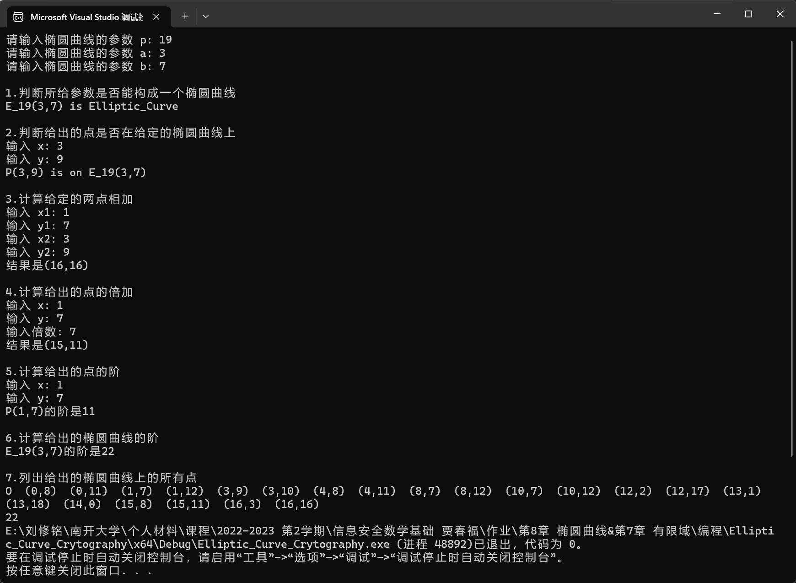

# <center>**椭圆曲线编程练习报告**</center>

### <center>姓名：刘修铭&emsp;&emsp;学号：2112492&emsp; 班级：信安一班</center>

### 一、源码部分

- Elliptic_Curve_Crytography.h

```c++
#pragma once
#include <bits/stdc++.h>
using namespace std;

class Point
{
public:
    int x, y;
    bool isINF; //是否是无穷远点
    Point(int x = 0, int y = 0, bool isINF = false);
    friend ostream& operator<< (ostream& out, const Point& p);
    bool operator ==(const Point& p);
    void Output(ostream& out) const;
};

class Elliptic_Curve
{
private:
    int p;
    int a, b;
public:
    Elliptic_Curve(int p, int a, int b);
    bool Is_Inverse(const Point& p1, const Point& p2); //判断两个点是否互逆
    bool Test_Is_Elliptic_Curve(); //检查当前参数是否能构成椭圆曲线
    bool Is_On_Elliptic_Curve(const Point& p); //判断p点是否在椭圆曲线上 
    Point Add(const Point& p1, const Point& p2); //进行点加运算
    Point Add_K_Times(Point p, int k); //对点p进行k倍加
    int Ord_Of_Point(const Point& p); //计算点p的阶
    int Ord_Of_Elliptic_Curve(); //计算此椭圆曲线的阶#E
    int Show_All_Points(); //展示出椭圆曲线上的所有点
};
```

* Elliptic_Curve_Crytography.cpp

```c++
#include "Elliptic_Curve_Crytography.h"

int Legendre(int a, int p) //p是奇素数, (a, p) = 1
{
    if (a < 0)
    {
        if (a == -1)
        {
            return p % 4 == 1 ? 1 : -1;
        }
        return Legendre(-1, p) * Legendre(-a, p);
    }
    a %= p;
    if (a == 1)
    {
        return 1;
    }
    else if (a == 2)
    {
        if (p % 8 == 1 || p % 8 == 7) return 1;
        else return -1;
    }
    // 下面将a进行素数分解
    int prime = 2;
    int ret = 1;
    while (a > 1)
    {
        int power = 0;
        while (a % prime == 0)
        {
            power++;
            a /= prime;
        }
        if (power % 2 == 1)
        {
            if (prime <= 2)
            {
                return Legendre(prime, p);
            }
            else
            {
                if (((prime - 1) * (p - 1) / 4) % 2 == 1)
                {
                    ret = -ret;
                }
                ret *= Legendre(p, prime);
            }
        }
        prime++;
    }
    return ret;
}

int pow(int x, int n) //x的n次方
{
    int ret = 1;
    while (n)
    {
        if (n & 1)
        {
            ret *= x;
        }
        x *= x;
        n >>= 1;
    }
    return ret;
}

int Get_Inverse(int a, int m) //在 (a, m) = 1 的条件下，求a模m的乘法逆元
{
    a = (a + m) % m;
    int s0 = 1, s1 = 0;
    int r0 = a, r1 = m;
    while (1)
    {
        int q = r0 / r1;
        int tmp = r1;
        r1 = r0 % r1;
        r0 = tmp;
        if (r1 == 0)
        {
            break;
        }
        tmp = s1;
        s1 = s0 - s1 * q;
        s0 = tmp;
    }
    return (s1 + m) % m;
}

Point::Point(int x, int y, bool isINF)
{
    this->x = x;
    this->y = y;
    this->isINF = isINF;
}

bool Point::operator == (const Point& p) 
{ 
    return x == p.x && y == p.y; 
}

ostream& operator<< (ostream& out, const Point& p)
{
    p.Output(out);
    return out;
}

void Point::Output(ostream& out) const
{
    if (isINF) cout << 'O';
    else cout << '(' << x << ',' << y << ')';
}

Elliptic_Curve::Elliptic_Curve(int p, int a, int b) //椭圆曲线构造函数
{
    this->p = p;
    this->a = a;
    this->b = b;
}

bool Elliptic_Curve::Is_Inverse(const Point& p1, const Point& p2) //判断两个点是否互逆
{
    return (p1.x - p2.x) % p == 0 && (p1.y + p2.y) % p == 0;
}

bool Elliptic_Curve::Test_Is_Elliptic_Curve() //检查当前参数是否能构成椭圆曲线
{
    int tmp = pow(a, 3) * 4 + pow(b, 2) * 27;
    return tmp % p != 0;
}

bool Elliptic_Curve::Is_On_Elliptic_Curve(const Point& p) //判断p点是否在椭圆曲线上
{
    int tmp = pow(pt.y, 2) - (pow(pt.x, 3) + a * pt.x + b);
    return tmp % p == 0;
}

Point Elliptic_Curve::Add(const Point& p1, const Point& p2)  //进行点加运算
{
    if (p1.isINF)
    {
        return p2;
    }
    else if (p2.isINF)
    {
        return p1;
    }
    else if (Is_Inverse(p1, p2))
    {
        return { 0, 0, true };
    }
    else
    {
        if ((p1.x - p2.x) % p == 0) //倍加公式
        {
            int k = ((3 * p1.x * p1.x + a) * Get_Inverse(2 * p1.y, p) % p + p) % p;
            int x3 = ((k * k - 2 * p1.x) % p + p) % p;
            int y3 = ((k * (p1.x - x3) - p1.y) % p + p) % p;
            return { x3, y3 };
        }
        else                        //点加公式
        {
            int k = ((p2.y - p1.y) * Get_Inverse(p2.x - p1.x, p) % p + p) % p;
            int x3 = ((k * k - p1.x - p2.x) % p + p) % p;
            int y3 = ((k * (p1.x - x3) - p1.y) % p + p) % p;
            return { x3, y3 };
        }
    }
}

Point Elliptic_Curve::Add_K_Times(Point p, int k) //对点p进行k倍加
{
    Point ret(0, 0, true);
    while (k)
    {
        if (k & 1)
        {
            ret = Add(ret, p);
        }
        p = Add(p, p);
        k >>= 1;
    }
    return ret;
}

int Elliptic_Curve::Ord_Of_Point(const Point& p) //计算点p的阶
{
    int ret = 1;
    Point tmp = pt;
    while (!tmp.isINF)
    {
        tmp = Add(tmp, pt);
        ++ret;
    }
    return ret;
}

int Elliptic_Curve::Ord_Of_Elliptic_Curve() //计算此椭圆曲线的阶#E
{
    int ret = 1;
    for (int x = 0; x < p; ++x)
    {
        int tmp = (x * x * x + a * x + b + p) % p;
        if (tmp == 0)
        {
            ret += 1;
        }
        else if (Legendre(tmp, p) == 1)
        {
            ret += 2;
        }
    }
    return ret;
}

int Elliptic_Curve::Show_All_Points() //展示出椭圆曲线上的所有点
{
    cout << "O ";
    int sum = 1;
    for (int x = 0; x < p; ++x)
    {
        int tmp = (x * x * x + a * x + b + p) % p;
        if (tmp == 0)
        {
            cout << " (" << x << ',' << "0) ";
            sum++;
        }
        else if (Legendre(tmp, p) == 1) //贡献两个点
        {
            for (int y = 1; y < p; ++y) //从1遍历到p-1，寻找解
            {
                if ((y * y - tmp) % p == 0)
                {
                    cout << " (" << x << ',' << y << ") ";
                    sum++;
                    cout << " (" << x << ',' << p - y << ") ";
                    sum++;
                    break;
                }
            }
        }
    }
    cout << endl;
    return sum;
}


```

* Experiment.cpp

```c++
#include "Elliptic_Curve_Crytography.h"
#define Elliptic_Curve_EC "E_" << p << "(" << a << ',' << b << ")"
#define Point_P "P(" << x << "," << y << ")"

int main()
{
    int p, a, b;
    cout << "请输入椭圆曲线的参数 p: ";
    cin >> p;
    cout << "请输入椭圆曲线的参数 a: ";
    cin >> a;
    cout << "请输入椭圆曲线的参数 b: ";
    cin >> b;

    Elliptic_Curve ec(p, a, b);
    int x, y;
    cout << endl;
    cout << "1.判断所给参数是否能构成一个椭圆曲线" << endl;
    cout << Elliptic_Curve_EC << " is ";
    if (!ec.Test_Is_Elliptic_Curve())
    {
        cout << "not ";
        return 0;
    }
    cout << "Elliptic_Curve" << endl;

    cout << endl;
    cout << "2.判断给出的点是否在给定的椭圆曲线上" << endl;
    cout << "输入 x: ";
    cin >> x;
    cout << "输入 y: ";
    cin >> y;
    cout << Point_P " is ";
    if (!ec.Is_On_Elliptic_Curve(Point(x, y))) cout << "not ";
    cout << "on " << Elliptic_Curve_EC << endl;

    cout << endl;
    cout << "3.计算给定的两点相加" << endl;
    int x1, y1, x2, y2;
    cout << "输入 x1: ";
    cin >> x1;
    cout << "输入 y1: ";
    cin >> y1;
    cout << "输入 x2: ";
    cin >> x2;
    cout << "输入 y2: ";
    cin >> y2;
    cout << "结果是" << ec.Add({ x1, y1 }, { x2, y2 }) << endl;

    cout << endl;
    cout << "4.计算给出的点的倍加" << endl;
    cout << "输入 x: ";
    cin >> x;
    cout << "输入 y: ";
    cin >> y;
    int times;
    cout << "输入倍数: ";
    cin >> times;
    cout << "结果是" << ec.Add_K_Times({ x, y }, times) << endl;

    cout << endl;
    cout << "5.计算给出的点的阶" << endl;
    cout << "输入 x: ";
    cin >> x;
    cout << "输入 y: ";
    cin >> y;
    cout << Point_P << "的阶是" << ec.Ord_Of_Point({ x, y }) << endl;

    cout << endl;
    cout << "6.计算给出的椭圆曲线的阶" << endl;
    cout << Elliptic_Curve_EC << "的阶是" << ec.Ord_Of_Elliptic_Curve() << endl;

    cout << endl;
    cout << "7.列出给出的椭圆曲线上的所有点" << endl;
    cout << ec.Show_All_Points();

    return 0;
}
```

### 二、说明部分

​		定义了两个类，`Point`和`Elliptic_Curve`，并包含了必要的标准库和`ostream`类的头文件。

​		`Point`类表示椭圆曲线上的一个点。它具有成员变量`x`和`y`，表示点的坐标，以及一个布尔变量`isINF`，表示该点是否为无穷远点。该类还包括一个友元类`elliptic_curve`和重载的`operator<<`，用于输出点的信息。

​		`Elliptic_Curve`类表示一个椭圆曲线。它具有私有成员变量`p`、`a`和`b`，表示椭圆曲线方程的参数。该类包括各种成员函数，用于在椭圆曲线上执行操作，例如测试参数是否构成有效的椭圆曲线，检查点是否在曲线上，点加法、点倍加法，计算点的阶和曲线的阶，以及显示曲线上的所有点。该类还包括辅助函数，如`Legendre`和`Get_Inverse`，用于计算Legendre符号和模素数的乘法逆元。

​		`main`函数提供了一个命令行界面，用于与椭圆曲线交互并执行各种操作，例如检查给定的参数是否构成有效的椭圆曲线，检查点是否在曲线上，点相加、点倍加，计算点的阶和曲线的阶，以及列出曲线上的所有点。

​		代码使用了一些特定于椭圆曲线密码学的数学概念和操作，如Legendre符号和点加法公式。

### 三、运行示例

